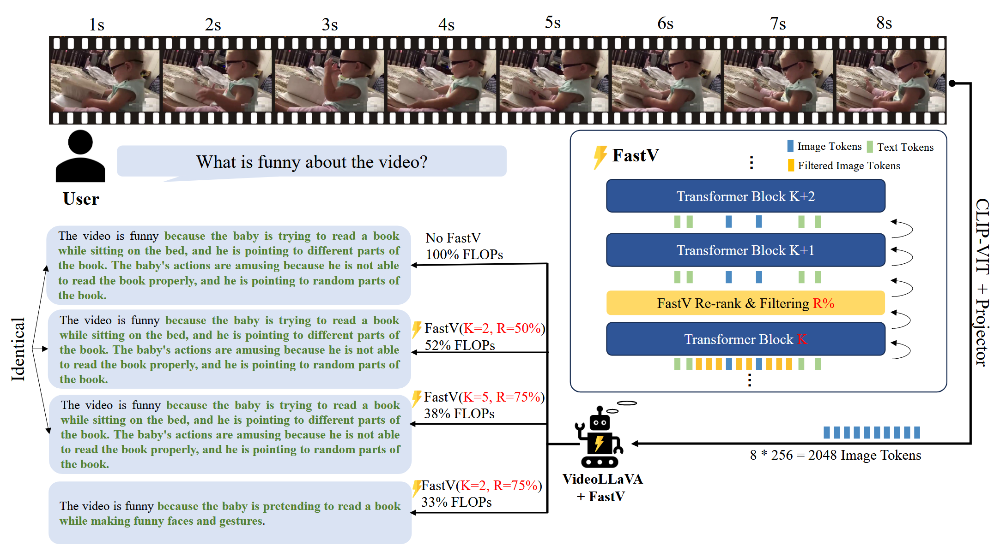

# FastV
Here, I implement FastV based on LLaVA, lmms-eval, and transformers.

## Authors

*Liang Chen, Haozhe Zhao, Tianyu Liu, Shuai Bai, Junyang Lin, Chang Zhou, Baobao Chang*

## Abstract

In this study, we identify the inefficient attention phenomena in Large Vision-Language Models (LVLMs), notably within prominent models like LLaVA-1.5, QwenVL-Chat and Video-LLaVA. We find out that the attention computation over visual tokens is of extreme inefficiency in the deep layers of popular LVLMs, suggesting a need for a sparser approach compared to textual data handling. To this end, we introduce FastV, a versatile plug-and-play method designed to optimize computational efficiency by learning adaptive attention patterns in early layers and pruning visual tokens in subsequent ones. Our evaluations demonstrate FastV's ability to dramatically reduce computational costs (e.g., a 45 reduction in FLOPs for LLaVA-1.5-13B) without sacrificing performance in a wide range of image and video understanding tasks. The computational efficiency and performance trade-off of FastV are highly customizable and pareto-efficient. It can compress the FLOPs of a 13B-parameter model to achieve a lower budget than that of a 7B-parameter model, while still maintaining superior performance. We believe FastV has practical values for deployment of LVLMs in edge devices and commercial models. Code is released at https://github.com/pkunlp-icler/FastV.

## Implementation

To implement FastV based on LLaVA, we need to modify [modeling_llama.py](./transformers/src/transformers/models/llama/modeling_llama.py) file. The main changes are located in the function `forward` in `LLamaModel`. Besides, we need to add a `cache_position` parameter to KVCache in [cache_utils.py](./transformers/src/transformers/cache_utils.py) in order to select the right key-value items from KV Cache after FastV token pruning.
